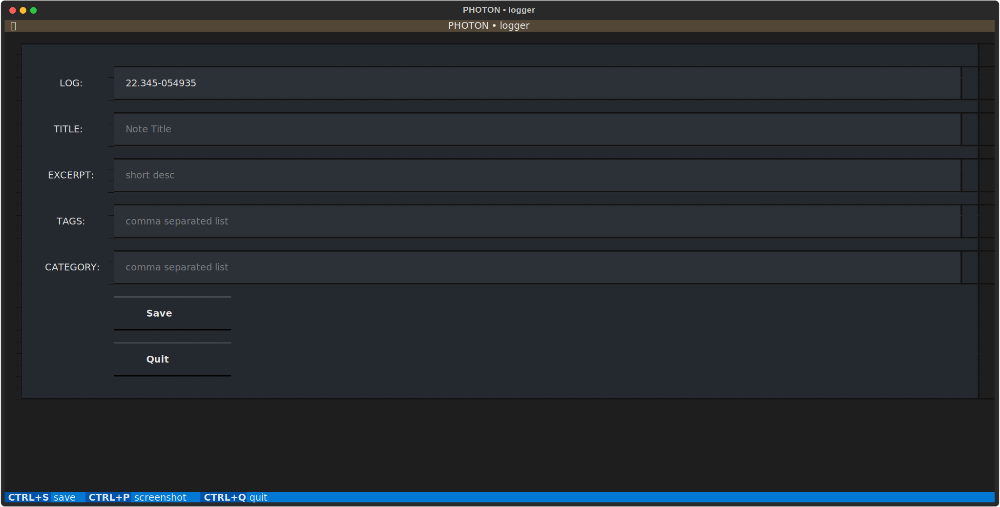

PHOTON logger
=============

This is a simple app to create log entries in the reST format.

The app is built in Python using the new Textual UI library.

.. (code|contents|admonition|table|csv-table|...):: 

    Content

.. (math|meta|parsed-literal|line-block|header|...)::

    Content

.. :: 

.. (image|figure|include):: file
.. FILE file does not exist

.. |file| im(age):: file
.. FILE file does not exist

.. i(mage|nclude):: file
.. FILE file does not exist

